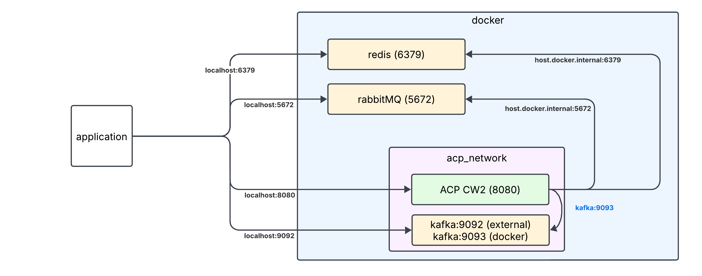

# Getting Started

The following sections describe in some detail the needed steps to setup the environment and give explanations why and how things are configured

## Background information

To run our container we need to have access to redis, kafka, rabbitMQ - either as other containers or standalone (host or cloud). 

Any access the application performs is controlled via environment variables which are passed in when running the container. This can be either done using the command line with <code>docker run --network xxx -e yyy </code> or in intelliJ  using a GUI. 
On my system this looks like:


For the different runtime environments I have different settings. The one above if for a docker environment. 
For a local process (which you will use most of your time) it looks like:


**So what is done?**

- Port binding is setup for 8080 to 8080 in the container
- a specialized network is used to have the docker image running in the same network as kafka. This way addressing via the name is possible (like in <code>kafka:9093</code>).
- the mentioned environment variables are defined to specify which host / port to use

Should Kafka be run in a secured environment (thus, at confluent.io and not locally) three more variables have to be set:
- KAFKA_SECURITY_PROTOCOL (usually <code>SASL_SSL</code>)
- KAFKA_SASL_MECHANISM (usually <code>PLAIN</code>)
- KAFKA_SASL_JAAS_CONFIG (usually <code>org.apache.kafka.common.security.plain.PlainLoginModule required username='....' password='...';</code>)

_The value for the JAAS config (only username / password are needed and the server must be adjusted) can be retrieved from your subscription._

**If either of these is set, all of them must be set - otherwise the template generates an error**

### Local development
For local development the easiest configuration looks like: 



Here, redis and rabbitMQ are running directly in docker, whereas kafka is running in is own network (for technical details why and how please refer to: https://www.confluent.io/en-gb/blog/kafka-client-cannot-connect-to-broker-on-aws-on-docker-etc/).

After the setup is done (see below), your docker dashboard will most likely look similar to this one (no mongo-db and postgre for now): 


### Maven pom.xml and environment variables

As the template uses a bean to load the runtime environment and during the <code>package</code> run of maven the unit tests are run, this will require some environment variables to be set during maven operations as otherwise the tests will fail.

```Java
@Configuration
public class AppConfig {
    @Bean
    public RuntimeEnvironment CurrentRuntimeEnvironment() {
        return RuntimeEnvironment.getEnvironment();
    }
}
```

This is handled by specifying the needed environment variables in the pom.xml in the relevant section:

```Maven
<plugin>
    <groupId>org.springframework.boot</groupId>
    <artifactId>spring-boot-maven-plugin</artifactId>

    <configuration>
        <systemPropertyVariables>
            <REDIS_HOST>localhost</REDIS_HOST>
            <REDIS_PORT>6379</REDIS_PORT>
            <RABBITMQ_HOST>localhost</RABBITMQ_HOST>
            <RABBITMQ_PORT>5672</RABBITMQ_PORT>
            <KAFKA_BOOTSTRAP_SERVERS>localhost:9092</KAFKA_BOOTSTRAP_SERVERS>
        </systemPropertyVariables>
    </configuration>
</plugin>
```


## Setting up the environment

The setup for the tutorials and CW2 is a bit complicated and needs attention. There are plenty of alternative approaches possible, the one shown below is one that works and is thus suggested. 
Please feel free to use your own approach...

**What do you need?** 

- docker installation (assumed to be present)
- rabbitMQ
- redis
- kafka
- kafka tools

### Installing redis

This will install redis as well as the management console (port 8001) 

```shell
docker run -d --name redis -p 6379:6379 -p 8001:8001 redis/redis-stack:latest`
```

### Testing redis

After the above installation you should have a docker dashboard entry which shows two lines (expand if necessary). One is 6379 for redis, the other 8001 for the management console. 

Clicking on the link (or http://localhost:8001/redis-stack/browser in the browser) will launch the Redis app where you can see your keys, etc. 

As soon as you triggered the cache endpoint in the ACP CW2 service using e.g. PUT http://127.0.0.1:8080/cache/myKey/This%20is%20a%20string it should show up like:


### Installing rabbitMQ

This will install rabbitMQ as well as the management console (port 15672)

```shell
docker run -it --rm -d --name rabbitmq -p 5672:5672 -p 15672:15672 rabbitmq:4.0-management
````

This will install the rabbitMQ engine and the UI for it. 

### Testing rabbitMQ

Testing can be easily done by clicking on the link with 15672 -> then a browser window with the management UI should show (**logon guest / guest**).


### Installing kafka

Installing Kafka can be done in very different ways - the one described here is simple and straightforward, yet doesn't use all available options.
It is based on the docker compose file [compose.yml](compose.yml).

For it to function first a private network needs to be created in docker (see the explanation above).
```shell
docker network create acp_network
```

After the network is created you can (using the provided compose.yml file) create a new installation (_which assumes the file compose.yml is in the same directory_) using
```shell
docker compose -p acp up -d 
```
With this command you load the docker compose file, create the kafka environment - using the predefined network acp_network - and create listeners for 9092 and 9093 (docker only).

### Create a topic in kafka

After the kafka environment is running you have to create a topic. The easiest way is to download the current kafka release (for details see: https://kafka.apache.org/quickstart) and then use the commands:

```shell
cd unpack-directory 
bin/kafka-topics.sh --bootstrap-server localhost:9092 --topic stockvalues  --create --partitions 2 --replication-factor 1
```

This will create a topic **stockvalues** with 2 partitions locally. 

## Deploying the ACP CW2 container

As can be seen above, the container can be run as standalone process or as a container in docker. Please use the corresponding execution target (top right in intelliJ). 

For docker you need to run <code>maven package</code> first, as otherwise there is no jar to execute.


### Testing

After you deployed the application you can test everything by running all commands in the API-test-file: [acp_cw2.http](acp_cw2.http)


### Special consideration for M4 machines

Should you modify anything make sure to include the necessary options for the Java runtime to exclude some instructions as otherwise SIGILL will be caused in docker 


## Swagger UI

To show the power of OpenAPI the project includes the OpenAPI 3.0 libraries to create a swagger UI dynamically (so, no need for you to do anything, unless you want to customize content).

For access, simply hit the endpoint swagger-ui/index.html like in:
http://localhost:8080/swagger-ui/index.html

## Reference Documentation
For further reference, please consider the following sections:
* [Kafka Quick-Start][kafka/quickstart] 
* [Redis][redis]
* [RabbitMQ][rabbitmq] 
* [Official Maven Documentation][mavenDocs]
* [Spring Boot Maven Plugin Reference Guide][springBootMavenPlugin]
* [Create an OCI Image][springBootMavenPluginBuildImage]
* [Spring Web][springBootDocs]

---

<!-- Variables for Easy Updates -->
[mavenDocs]: https://maven.apache.org/guides/index.html
[springBootMavenPlugin]: https://docs.spring.io/spring-boot/docs/3.2.2/maven-plugin/reference/html/
[springBootMavenPluginBuildImage]: https://docs.spring.io/spring-boot/docs/3.2.2/maven-plugin/reference/htmlsingle/#build-image
[springBootDocs]: https://docs.spring.io/spring-boot/docs/3.2.2/reference/htmlsingle/index.html#web
[springGuides]: https://spring.io/guides
[kafka]: https://kafka.apache.org/
[kafka/quickstart]: https://kafka.apache.org/quickstart
[redis]: https://redis.io/
[rabbitmq]: https://www.rabbitmq.com/